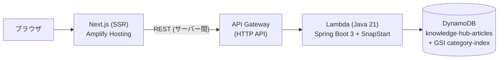

# Knowledge Hub — 社内ナレッジ/FAQ管理システム

ポートフォリオ用の動的 Web アプリケーション。社内のナレッジ・FAQ を蓄積・検索・共有するためのシステムで、**Next.js (SSR) + Spring Boot 3 + DynamoDB** の 3 層構成を AWS 常時無料枠に収まるサーバーレスで動かす。

| 層 | 技術 | 役割 |
|----|------|------|
| フロントエンド | Next.js 15 (App Router / SSR) + TypeScript | 画面。Server Components + Server Actions で SPA を避けたモダンな MPA |
| バックエンド | Spring Boot 3 (Java 21) | REST API。記事の CRUD・検索・バリデーション |
| データベース | Amazon DynamoDB | 記事の永続化。カテゴリ絞り込みは GSI で Query |
| インフラ | AWS Lambda + API Gateway (SAM) | サーバーレス実行基盤。SnapStart でコールドスタート対策 |

詳細な設計(画面・API・データ・モジュール構成・非機能)は **[設計書](docs/設計書.md)** を参照。

## アーキテクチャ



- **SSR 中心の設計**: 一覧・詳細・フォームはすべて Server Components でサーバーレンダリング。作成/更新/削除は Server Actions で処理し、クライアント JS は確認ダイアログとフォームエラー表示のみ
- **リポジトリの差し替え**: `ArticleRepository` インターフェースに対して DynamoDB 実装とインメモリ実装があり、Spring プロファイルで切替。ローカルは AWS なしで完結する
- **無料枠の根拠**: Lambda (100万req/月・常時無料)、DynamoDB (プロビジョンド 25RCU/WCU・常時無料。prod 10 + 共有 dev 10 = 合計 20RCU/20WCU を割当)、API Gateway HTTP API (100万req/月・12ヶ月無料)

## API 仕様

| メソッド | パス | 説明 |
|---------|------|------|
| GET | `/api/articles?category=&tag=&q=` | 記事一覧 (カテゴリ/タグ/キーワード絞り込み) |
| GET | `/api/articles/{id}` | 記事の取得 |
| POST | `/api/articles` | 記事の作成 (201) |
| PUT | `/api/articles/{id}` | 記事の更新 |
| DELETE | `/api/articles/{id}` | 記事の削除 (204) |

エラーは `{"message": "...", "errors": ["field: 理由", ...]}` に統一 (400/404)。

## ローカルでの動かし方

前提: **JDK 21** / **Maven** / **Node.js 20+**

```bash
# 1. バックエンド (http://localhost:8080, インメモリDB + シードデータ)
cd backend
mvn spring-boot:run
```

```bash
# 2. フロントエンド (http://localhost:3000)
cd frontend
npm install
npm run dev
```

プロファイル未指定ではインメモリ実装 (`local` プロファイル) で起動するため AWS 環境は不要。DynamoDB Local で試す場合:

```bash
docker run -p 8000:8000 amazon/dynamodb-local
# テーブル作成後、以下で起動
SPRING_PROFILES_ACTIVE=prod DYNAMODB_ENDPOINT=http://localhost:8000 mvn spring-boot:run
```

### テスト

```bash
cd backend
mvn test
```

- `ArticleServiceTest` — 検索条件・タグ正規化・更新/削除のユニットテスト
- `ArticleControllerTest` — MockMvc による API 通しテスト (バリデーション・404 含む)

## AWS へのデプロイ

prod と共有 dev の 2 環境構成。SAM テンプレートは 1 本共通で、リソース物理名は `${AWS::StackName}` ベースに環境ごとへ解決される (prod の物理名は従来と同一)。

| 環境 | トリガー | SAM スタック | フロントエンド |
|------|---------|-------------|---------------|
| prod | `main` への push | `knowledge-hub` | Amplify `main` ブランチ |
| dev (共有・常設) | `ai/**` への push | `knowledge-hub-dev` | Amplify 自動ブランチ作成 (`ai/*`。ブランチごとの URL) |

### バックエンド (SAM)

**通常は自動デプロイ**: `main` / `ai/**` ブランチへの push で GitHub Actions (`.github/workflows/deploy.yml`) がテスト → `sam deploy` → 疎通確認まで実行する。ブランチで環境を振り分け (`main` → prod / `ai/**` → dev。それ以外の ref はデプロイに進まず失敗するフェイルクローズ)、認証は OIDC(`infra/github-oidc.yaml` の `knowledge-hub-github-deploy` ロール。`main`・`ai/*` ブランチ限定の AssumeRole で、GitHub に AWS キーは保存しない)。

手動でデプロイする場合:

```bash
cd backend
mvn -q package -DskipTests
cd ../infra
sam deploy --profile portfolio                   # prod (スタック knowledge-hub)
sam deploy --config-env dev --profile portfolio  # dev  (スタック knowledge-hub-dev)
```

`sam deploy` の出力 `ApiEndpoint` がフロントエンドの `API_BASE_URL` になる。dev の `CorsAllowedOrigin` はテンプレートデフォルトのまま (API 呼び出しは SSR 経由のみでブラウザ直呼びがないため)。

### フロントエンド (prod)

推奨は **AWS Amplify Hosting** (Next.js SSR 対応、無料枠あり):

1. Amplify コンソールで GitHub リポジトリを接続し、モノレポのルートを `knowledge-hub/frontend` に設定
2. 環境変数 `API_BASE_URL` に SAM の `ApiEndpoint` を設定
3. デプロイ後、Amplify の URL を SAM の `CorsAllowedOrigin` パラメータに反映して再デプロイ

`next.config.ts` は `output: "standalone"` にしてあるため、Lambda Web Adapter + Lambda 関数 URL によるセルフホストにも対応できる。

### フロントエンド (dev: Amplify 自動ブランチ作成)

`ai/*` ブランチの push でブランチごとの環境が自動作成され、ブランチ削除で自動削除される (branchAutoDeletion。dev SAM スタックは常設で残る)。git 管理外の AWS 側設定のため、設定手順をここに記録する (実施済み: 2026-08-14。appId は `aws amplify list-apps` で確認)。

1. 自動ブランチ作成・自動削除・ブランチ用環境変数を有効化する:

   ```bash
   aws amplify update-app --app-id d1e1o87p5asykz --profile portfolio --region ap-northeast-1 \
     --enable-auto-branch-creation \
     --enable-branch-auto-deletion \
     --auto-branch-creation-patterns "ai/*" "ai/**" \
     --auto-branch-creation-config '{"stage":"DEVELOPMENT","framework":"Next.js - SSR","enableAutoBuild":true,"enablePullRequestPreview":false,"environmentVariables":{"API_BASE_URL":"https://rfpwpg8xo5.execute-api.ap-northeast-1.amazonaws.com"}}'
   ```

   - `API_BASE_URL` には dev API (スタック `knowledge-hub-dev` の Output `ApiEndpoint`) を設定する。これは**ブランチレベル**の環境変数としてアプリレベル (prod URL) を上書きするため、ブランチ env を持たない `main` は prod のまま変わらない
   - アプリレベル環境変数・`main` ブランチ設定・`amplify.yml` は変更しない
2. 設定より**前に** push 済みのブランチは自動作成の対象外のため、1 回だけ手動で取り込む:

   ```bash
   aws amplify create-branch --app-id d1e1o87p5asykz --branch-name ai/dev-env-deploy \
     --stage DEVELOPMENT --framework "Next.js - SSR" --enable-auto-build \
     --environment-variables API_BASE_URL=https://rfpwpg8xo5.execute-api.ap-northeast-1.amazonaws.com \
     --profile portfolio --region ap-northeast-1
   aws amplify start-job --app-id d1e1o87p5asykz --branch-name ai/dev-env-deploy \
     --job-type RELEASE --profile portfolio --region ap-northeast-1
   ```

   (設定後に push で新規作成されるブランチはこの手順不要)
3. ブランチ環境の URL は `https://{displayName}.d1e1o87p5asykz.amplifyapp.com`。displayName はブランチ名のスラッシュがハイフンに置換されたもの (例: `ai/dev-env-deploy` → `https://ai-dev-env-deploy.d1e1o87p5asykz.amplifyapp.com`)

## 設計上の割り切り (ポートフォリオとしてのスコープ)

- キーワード検索は Scan + アプリ側フィルタ。数百件規模を想定しており、大規模化時は OpenSearch 等の検索基盤とページネーションの導入が前提
- 認証は未実装 (社内システム想定のため IP 制限 or Cognito を将来課題として明記)
- 記事の履歴管理・添付ファイルはスコープ外
