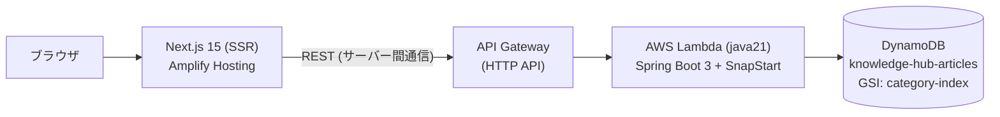
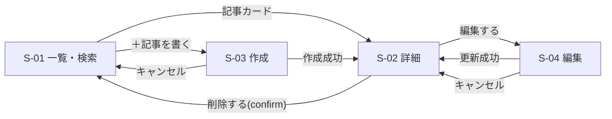
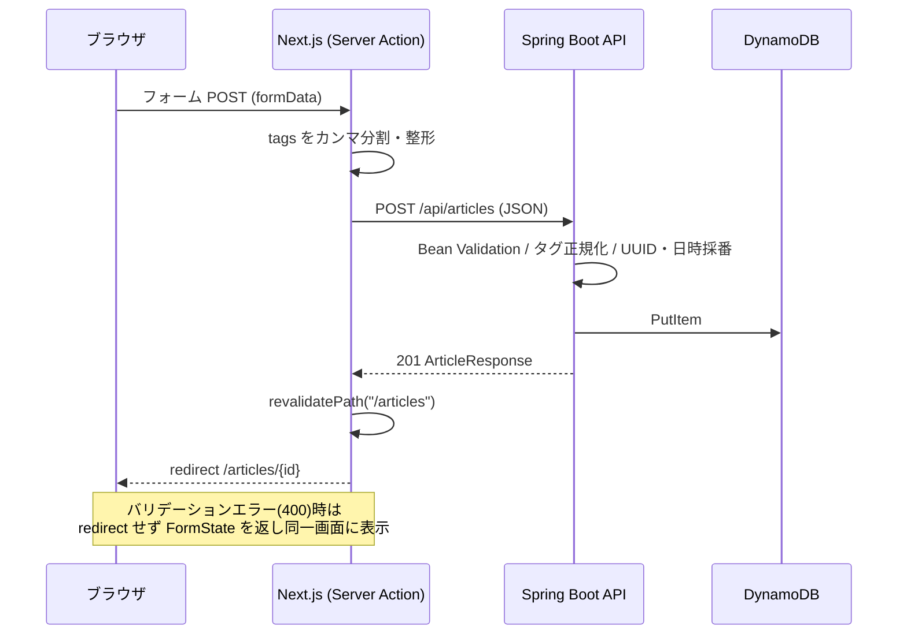

# Knowledge Hub 設計書

| 項目 | 内容 |
|------|------|
| 対象システム | Knowledge Hub — 社内ナレッジ/FAQ管理システム |
| 文書種別 | 基本設計書(実装済みシステムの設計記録) |
| 版 | 1.0 (2026-08-14) |
| 関連文書 | [README.md](../README.md)(概要・手順) / [infra/template.yaml](../infra/template.yaml)(インフラ定義の正) |

---

## 1. システム概要

### 1.1 目的

社内に散在するナレッジ・FAQ を一元的に蓄積し、カテゴリ・タグ・キーワードで検索して共有できるようにする。本システムはポートフォリオ作品であり、モダンな SSR フロントエンド + Java REST API + NoSQL を AWS サーバーレス(常時無料枠)で運用する構成の実証を兼ねる。

### 1.2 利用者と利用シーン

| 利用者 | シーン |
|--------|--------|
| 一般社員 | 困りごとをキーワード検索し、FAQ 記事を閲覧する |
| ナレッジ執筆者 | 記事の作成・更新・タグ付けを行う(Markdown 記法) |

認証は現バージョンのスコープ外(社内ネットワーク内での利用を想定。§9.3 参照)。

### 1.3 機能一覧

| # | 機能 | 概要 |
|---|------|------|
| F-01 | 記事一覧 | 更新日時降順の一覧表示。件数表示 |
| F-02 | 記事検索 | キーワード(タイトル・本文)、カテゴリ、タグによる絞り込み。複合条件可 |
| F-03 | 記事閲覧 | Markdown レンダリング表示(GFM 対応: 表・リスト等) |
| F-04 | 記事作成 | タイトル/カテゴリ/タグ/本文の入力。入力検証あり |
| F-05 | 記事更新 | 既存記事の編集。作成日時は保持し更新日時のみ更新 |
| F-06 | 記事削除 | 確認ダイアログ付き削除 |

## 2. システム構成

### 2.1 全体構成図



### 2.2 技術スタックと選定理由

| 層 | 技術 | 選定理由 |
|----|------|----------|
| フロントエンド | Next.js 15 (App Router) + TypeScript | React を使いつつ SPA を避ける方針のため SSR + Server Actions を採用。SEO・初期表示・フォーム処理をサーバー側に寄せ、クライアント JS を最小化 |
| バックエンド | Spring Boot 3.5 (Java 21) | Java での API 設計を示す。Bean Validation・例外ハンドラ等の標準機構を活用 |
| DB | DynamoDB | サーバーレス構成との親和性と常時無料枠。RDB を要しないシンプルなドキュメント構造 |
| 実行基盤 | Lambda + API Gateway HTTP API | 常時無料枠での長期公開。SnapStart で JVM コールドスタートを緩和 |
| IaC | AWS SAM | Lambda 中心構成の記述が簡潔。`sam validate` を CI に組込み |

### 2.3 実行環境の切替(プロファイル設計)

| プロファイル | リポジトリ実装 | 用途 |
|--------------|----------------|------|
| `local`(デフォルト) | `InMemoryArticleRepository` + シードデータ 4 件 | AWS 不要のローカル開発・デモ・MockMvc テスト |
| `prod`(Lambda で指定) | `DynamoDbArticleRepository` | 本番。`TABLE_NAME`・リージョン・認証情報は Lambda 実行環境から解決 |

`DYNAMODB_ENDPOINT` 環境変数を設定すると DynamoDB Local へ向けられる(prod プロファイルのまま接続先のみ差し替え)。

## 3. 画面設計

画面ごとの詳細仕様(レイアウト・項目定義・イベント定義・異常系)は **画面単位の画面設計書**([docs/screens/](screens/))に分割して管理する。

### 3.1 画面一覧

| 画面ID | パス | 画面名 | レンダリング | 画面設計書 |
|--------|------|--------|--------------|------------|
| S-01 | `/articles` | 記事一覧・検索 | SSR(動的) | [S-01_記事一覧.md](screens/S-01_記事一覧.md) |
| S-02 | `/articles/{id}` | 記事詳細 | SSR(動的) | [S-02_記事詳細.md](screens/S-02_記事詳細.md) |
| S-03 | `/articles/new` | 記事作成フォーム | SSR + クライアントフォーム | [S-03_記事作成.md](screens/S-03_記事作成.md) |
| S-04 | `/articles/{id}/edit` | 記事編集フォーム | SSR + クライアントフォーム | [S-04_記事編集.md](screens/S-04_記事編集.md)(S-03 との差分定義) |
| — | `/` | S-01 へリダイレクト | — | — |

### 3.2 画面遷移図



### 3.3 画面共通仕様

- **共通ヘッダー**: ロゴ(一覧へ)・「記事一覧」リンク・「＋記事を書く」ボタン(全画面。`layout.tsx`)
- **フォーム共通**: S-03/S-04 は共通コンポーネント `ArticleForm`。`useActionState` + Server Actions でページ遷移なしのエラー表示。バリデーションの正はサーバー側(全体は §4.3)
- **デザイン**: 和紙×墨×朱のエディトリアルテーマ。フォントは Shippori Mincho(見出し)/ Zen Kaku Gothic New(本文)/ IBM Plex Mono(メタ情報)。トークンは `globals.css` の CSS 変数に集約

## 4. API 設計

### 4.1 エンドポイント一覧

ベースパス: `/api`。リクエスト/レスポンスは JSON(UTF-8)。

| # | メソッド | パス | 機能 | 正常応答 |
|---|---------|------|------|----------|
| A-01 | GET | `/articles` | 一覧・検索 | 200: `ArticleResponse[]`(updatedAt 降順) |
| A-02 | GET | `/articles/{id}` | 1件取得 | 200: `ArticleResponse` |
| A-03 | POST | `/articles` | 作成 | 201: `ArticleResponse` |
| A-04 | PUT | `/articles/{id}` | 更新(全項目置換) | 200: `ArticleResponse` |
| A-05 | DELETE | `/articles/{id}` | 削除 | 204: ボディなし |

### 4.2 検索パラメータ(A-01)

| パラメータ | 処理位置 | 意味 |
|-----------|----------|------|
| `category` | リポジトリ層(DynamoDB では GSI Query) | カテゴリ完全一致 |
| `tag` | サービス層 | タグ完全一致(配列内包含) |
| `q` | サービス層 | タイトル・本文の部分一致(大文字小文字無視) |

3 条件は AND で複合。いずれも省略可。

### 4.3 リクエストボディとバリデーション(A-03/A-04 共通)

| 項目 | 型 | 制約 |
|------|----|------|
| `title` | string | 必須、最大 200 文字 |
| `body` | string | 必須、最大 50,000 文字(Markdown) |
| `category` | string | 必須、最大 50 文字 |
| `tags` | string[] | 任意、最大 10 個、各 30 文字以内。前後空白除去・空要素除去・重複排除はサーバー側で実施 |

### 4.4 エラー仕様

全エラーを `ApiExceptionHandler` で以下の形式に統一する:

```json
{ "message": "入力内容に誤りがあります", "errors": ["title: タイトルは必須です"] }
```

| ステータス | 発生条件 |
|-----------|----------|
| 400 | Bean Validation 違反(`errors` に項目別詳細) |
| 404 | 指定 ID の記事が存在しない(取得・更新・削除共通。削除は事前存在確認を行う) |

### 4.5 CORS

`/api/**` に対し、許可オリジン(`CORS_ALLOWED_ORIGINS`、既定 `http://localhost:3000`)からの GET/POST/PUT/DELETE を許可。SSR(サーバー間通信)は CORS の対象外であり、本設定はブラウザから直接 API を叩く場合の保険。

## 5. データ設計

属性ごとの詳細定義(制約・例・インデックス・運用設定)は **[テーブル定義書](テーブル定義書.md)** を参照。本章では設計方針と概要を示す。

### 5.1 テーブル定義: `knowledge-hub-articles`

| 属性 | 型 | 説明 |
|------|----|------|
| `id` (PK) | S | UUID v4。サーバー側で採番 |
| `title` | S | タイトル |
| `body` | S | 本文(Markdown 原文) |
| `category` | S | カテゴリ(GSI パーティションキー) |
| `tags` | L(S) | タグ配列 |
| `createdAt` | S | 作成日時(ISO-8601 / UTC Instant) |
| `updatedAt` | S | 更新日時(同上。GSI ソートキー) |

### 5.2 インデックスとアクセスパターン

| アクセスパターン | 実現方法 |
|------------------|----------|
| ID で 1 件取得 | テーブル GetItem |
| 全件一覧(更新日時降順) | テーブル Scan + アプリ側ソート |
| カテゴリ別一覧 | GSI `category-index`(PK: `category`, SK: `updatedAt`, 射影: ALL)への Query |
| タグ・キーワード絞り込み | 上記結果に対するサービス層フィルタ |

**キー設計方針**: 記事エンティティ単独で完結しリレーションがないため、シングルテーブル設計(PK/SK 合成キー)は採らず素直な単一エンティティ構成とした。数百件規模を前提に Scan を許容しており、スケール時の拡張方針は §9.4 に記載。

### 5.3 キャパシティ

プロビジョンドモード(テーブル 5RCU/5WCU、GSI 5RCU/5WCU)。アカウントの常時無料枠(合計 25RCU/25WCU)に収める。**オンデマンド課金への変更は禁止**(guard-rules.json `dynamodb-on-demand` で機械検査)。

## 6. モジュール設計

### 6.1 バックエンド(`com.knowledgehub.api`)

```
KnowledgeHubApplication      … エントリポイント
StreamLambdaHandler          … Lambda 入口(aws-serverless-java-container。ローカルでは不使用)
article/
  ArticleController          … REST 入出力・ステータスコード
  ArticleService             … 業務ロジック(採番・日時・タグ正規化・検索フィルタ・存在確認)
  ArticleRepository          … 永続化の抽象(インターフェース)
  DynamoDbArticleRepository  … prod 実装(Enhanced Client。@Profile("!local"))
  InMemoryArticleRepository  … local 実装(ConcurrentHashMap。@Profile("local"))
  Article                    … ドメイン兼 DynamoDB Bean(@DynamoDbBean)
  dto/ArticleRequest         … 入力 DTO(Bean Validation を担持)
  dto/ArticleResponse        … 出力 DTO(Article からの変換ファクトリ)
common/
  NotFoundException          … 404 例外
  ApiExceptionHandler        … エラー形式の統一(@RestControllerAdvice)
config/
  AppConfig                  … Clock Bean(テスト時に固定可能)・CORS
  DynamoDbConfig             … DynamoDB クライアント(endpoint 上書き対応)
  LocalSeedData              … local 用シード投入(CommandLineRunner)
```

依存方向: Controller → Service → Repository(インターフェース)。日時は `Clock` を注入して取得し、テストでは `Clock.fixed` で決定論化する。

### 6.2 フロントエンド(`frontend/src`)

```
app/
  layout.tsx                 … 共通レイアウト(ヘッダー・フォント・メタデータ)
  page.tsx                   … / → /articles リダイレクト
  articles/page.tsx          … S-01 一覧(Server Component)
  articles/[id]/page.tsx     … S-02 詳細(Server Component)
  articles/[id]/edit/page.tsx… S-04 編集
  articles/[id]/not-found.tsx… 404 表示
  articles/new/page.tsx      … S-03 作成
  globals.css                … デザイントークン(CSS 変数)+ 全スタイル
components/
  ArticleForm.tsx            … 作成/編集共通フォーム(client。useActionState)
  DeleteButton.tsx           … confirm 付き削除(client)
lib/
  api.ts                     … API クライアント(fetch ラッパー・ApiRequestError)
  actions.ts                 … Server Actions(create/update/delete。"use server")
  types.ts                   … 型定義(Article ほか)
```

クライアントコンポーネントは `ArticleForm` と `DeleteButton` の 2 つのみ(SPA 化しない方針の実装)。API のベース URL は環境変数 `API_BASE_URL`(サーバー側でのみ参照。ブラウザへは露出しない)。

## 7. 主要シーケンス

### 7.1 記事作成(F-04)



### 7.2 検索(F-02)

1. S-01 の GET フォーム/チップリンクで `/articles?q=&category=&tag=` に遷移
2. Server Component が `GET /api/articles?...` を実行(`cache: "no-store"` で常に最新)
3. API 側: `category` → リポジトリ(GSI Query)、`tag`・`q` → サービス層フィルタ、結果を `updatedAt` 降順で返却

## 8. エラーハンドリング設計

| 発生箇所 | 事象 | 挙動 |
|----------|------|------|
| API | 入力検証違反 | 400 + 項目別メッセージ(§4.4) → フォーム画面に表示 |
| API | 記事なし | 404 → 詳細/編集画面は `notFound()` で 404 画面へ |
| フロント | API 接続不可 | `ApiRequestError` 以外の例外を捕捉し「APIに接続できません」を FormState で表示(フォーム時)。表示系は Next.js のエラーバウンダリに委譲 |
| Lambda | ハンドラ初期化失敗 | `IllegalStateException` で fail-fast(SnapStart のスナップショットに乗せない) |

## 9. 非機能設計

### 9.1 性能

- SnapStart(PublishedVersions)で JVM コールドスタートを短縮。メモリ 1024MB
- 一覧 Scan はポートフォリオ規模(数百件)前提。SSR は `no-store` のため毎回取得(キャッシュ戦略は将来課題)

### 9.2 コスト(無料枠適合)

| リソース | 無料枠 | 本設計 |
|----------|--------|--------|
| Lambda | 100万 req/月・40万 GB-秒(常時) | 想定アクセスで余裕 |
| DynamoDB | 25RCU/25WCU・25GB(常時) | 10RCU/10WCU をプロビジョン |
| API Gateway (HTTP) | 100万 req/月(12ヶ月) | 期限後も低単価 |
| Amplify Hosting | ビルド・配信の無料枠 | フロント配信 |

### 9.3 セキュリティ

- 秘密情報はコードに置かない(環境変数/SAM パラメータ。guard-rules.json `aws-credentials` で機械検査)
- Lambda 実行ロールは `DynamoDBCrudPolicy`(対象テーブル限定)の最小権限
- XSS: Markdown は react-markdown でレンダリングし、生 HTML は挿入しない
- 認証・認可は未実装(現スコープ外)。公開運用する場合は Cognito + API Gateway オーソライザ、または IP 制限を導入する

### 9.4 拡張時の課題(設計上の割り切り)

| 割り切り | スケール時の方針 |
|----------|------------------|
| 一覧が Scan | ページネーション(ExclusiveStartKey)+ 一覧射影の GSI 追加 |
| キーワード検索がアプリ側フィルタ | OpenSearch Serverless 等の検索基盤へ委譲 |
| タグ絞り込みがアプリ側 | タグ転置テーブル(tag → articleId)の追加 |
| 認証なし | Cognito 導入。記事に作成者・権限の属性追加 |

## 10. デプロイ・CI 設計

- **CI**(GitHub Actions `ci.yml`): backend `mvn verify` / frontend `typecheck`+`build` / `sam validate --lint` の 3 ジョブを push/PR で実行
- **CD**(GitHub Actions `deploy.yml`): main への push(backend/infra 変更時)で テスト → `sam deploy` → API 疎通確認を自動実行。認証は **OIDC**(`infra/github-oidc.yaml`)— 対象リポジトリの main ブランチからのみ AssumeRole 可能で、長期アクセスキーを GitHub に保存しない
- **バックエンド(手動時)**: `mvn package`(shade で Lambda 用 jar 生成)→ `sam deploy --profile portfolio`。API URL は Stack Output `ApiEndpoint`
- **フロントエンド**: Amplify Hosting に GitHub 連携でデプロイ(モノレポルート `knowledge-hub/frontend`、環境変数 `API_BASE_URL`)。デプロイ後、Amplify の URL を SAM パラメータ `CorsAllowedOrigin` に反映
- 開発フロー: 修正タスクは ai-dev-flow(`/ai-flow`)に従う。コミットは pre-commit フックの禁止パターン Lint を通過する必要がある
